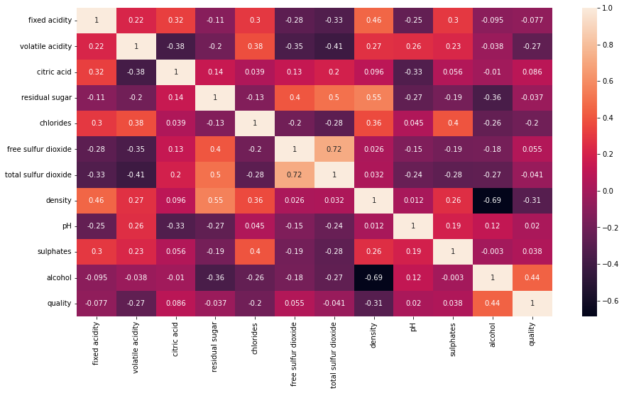

# Wine Quality

## Dataset Credits:

http://www3.dsi.uminho.pt/pcortez/wine/

*P. Cortez, A. Cerdeira, F. Almeida, T. Matos and J. Reis. Modeling wine preferences by data mining from physicochemical properties. In Decision Support Systems, Elsevier, 47(4):547-553, 2009.*


```python
%config Completer.use_jedi = False
import warnings
warnings.filterwarnings('ignore')
```


```python
import matplotlib.pyplot as plt
import seaborn as sb
```


```python
import pandas as pd
import numpy as np
import plotly.express as px
import plotly.graph_objects as go
import seaborn as sb
from plotly.subplots import make_subplots

#from sklearn import linear_model
from sklearn.linear_model import Lasso
from sklearn.linear_model import Ridge
from sklearn.model_selection import train_test_split
from sklearn.metrics import mean_squared_error
from sklearn.linear_model import RidgeCV
from sklearn.linear_model import LassoCV
from sklearn.metrics import classification_report, confusion_matrix
```


```python
dfr = pd.read_csv('./data/winequality/winequality-red.csv', sep=';')
dfw = pd.read_csv('./data/winequality/winequality-white.csv', sep=';')
```


```python
dfw['type'] = 'white'
dfr['type'] = 'red'
df = pd.concat([dfw, dfr])
display(df.head())
display(df.tail())
```


<div>
<style scoped>
    .dataframe tbody tr th:only-of-type {
        vertical-align: middle;
    }

    .dataframe tbody tr th {
        vertical-align: top;
    }

    .dataframe thead th {
        text-align: right;
    }
</style>
<table border="1" class="dataframe">
  <thead>
    <tr style="text-align: right;">
      <th></th>
      <th>fixed acidity</th>
      <th>volatile acidity</th>
      <th>citric acid</th>
      <th>residual sugar</th>
      <th>chlorides</th>
      <th>free sulfur dioxide</th>
      <th>total sulfur dioxide</th>
      <th>density</th>
      <th>pH</th>
      <th>sulphates</th>
      <th>alcohol</th>
      <th>quality</th>
      <th>type</th>
    </tr>
  </thead>
  <tbody>
    <tr>
      <th>0</th>
      <td>7.0</td>
      <td>0.27</td>
      <td>0.36</td>
      <td>20.7</td>
      <td>0.045</td>
      <td>45.0</td>
      <td>170.0</td>
      <td>1.0010</td>
      <td>3.00</td>
      <td>0.45</td>
      <td>8.8</td>
      <td>6</td>
      <td>white</td>
    </tr>
    <tr>
      <th>1</th>
      <td>6.3</td>
      <td>0.30</td>
      <td>0.34</td>
      <td>1.6</td>
      <td>0.049</td>
      <td>14.0</td>
      <td>132.0</td>
      <td>0.9940</td>
      <td>3.30</td>
      <td>0.49</td>
      <td>9.5</td>
      <td>6</td>
      <td>white</td>
    </tr>
    <tr>
      <th>2</th>
      <td>8.1</td>
      <td>0.28</td>
      <td>0.40</td>
      <td>6.9</td>
      <td>0.050</td>
      <td>30.0</td>
      <td>97.0</td>
      <td>0.9951</td>
      <td>3.26</td>
      <td>0.44</td>
      <td>10.1</td>
      <td>6</td>
      <td>white</td>
    </tr>
    <tr>
      <th>3</th>
      <td>7.2</td>
      <td>0.23</td>
      <td>0.32</td>
      <td>8.5</td>
      <td>0.058</td>
      <td>47.0</td>
      <td>186.0</td>
      <td>0.9956</td>
      <td>3.19</td>
      <td>0.40</td>
      <td>9.9</td>
      <td>6</td>
      <td>white</td>
    </tr>
    <tr>
      <th>4</th>
      <td>7.2</td>
      <td>0.23</td>
      <td>0.32</td>
      <td>8.5</td>
      <td>0.058</td>
      <td>47.0</td>
      <td>186.0</td>
      <td>0.9956</td>
      <td>3.19</td>
      <td>0.40</td>
      <td>9.9</td>
      <td>6</td>
      <td>white</td>
    </tr>
  </tbody>
</table>
</div>


<div>
<style scoped>
    .dataframe tbody tr th:only-of-type {
        vertical-align: middle;
    }

    .dataframe tbody tr th {
        vertical-align: top;
    }

    .dataframe thead th {
        text-align: right;
    }
</style>
<table border="1" class="dataframe">
  <thead>
    <tr style="text-align: right;">
      <th></th>
      <th>fixed acidity</th>
      <th>volatile acidity</th>
      <th>citric acid</th>
      <th>residual sugar</th>
      <th>chlorides</th>
      <th>free sulfur dioxide</th>
      <th>total sulfur dioxide</th>
      <th>density</th>
      <th>pH</th>
      <th>sulphates</th>
      <th>alcohol</th>
      <th>quality</th>
      <th>type</th>
    </tr>
  </thead>
  <tbody>
    <tr>
      <th>1594</th>
      <td>6.2</td>
      <td>0.600</td>
      <td>0.08</td>
      <td>2.0</td>
      <td>0.090</td>
      <td>32.0</td>
      <td>44.0</td>
      <td>0.99490</td>
      <td>3.45</td>
      <td>0.58</td>
      <td>10.5</td>
      <td>5</td>
      <td>red</td>
    </tr>
    <tr>
      <th>1595</th>
      <td>5.9</td>
      <td>0.550</td>
      <td>0.10</td>
      <td>2.2</td>
      <td>0.062</td>
      <td>39.0</td>
      <td>51.0</td>
      <td>0.99512</td>
      <td>3.52</td>
      <td>0.76</td>
      <td>11.2</td>
      <td>6</td>
      <td>red</td>
    </tr>
    <tr>
      <th>1596</th>
      <td>6.3</td>
      <td>0.510</td>
      <td>0.13</td>
      <td>2.3</td>
      <td>0.076</td>
      <td>29.0</td>
      <td>40.0</td>
      <td>0.99574</td>
      <td>3.42</td>
      <td>0.75</td>
      <td>11.0</td>
      <td>6</td>
      <td>red</td>
    </tr>
    <tr>
      <th>1597</th>
      <td>5.9</td>
      <td>0.645</td>
      <td>0.12</td>
      <td>2.0</td>
      <td>0.075</td>
      <td>32.0</td>
      <td>44.0</td>
      <td>0.99547</td>
      <td>3.57</td>
      <td>0.71</td>
      <td>10.2</td>
      <td>5</td>
      <td>red</td>
    </tr>
    <tr>
      <th>1598</th>
      <td>6.0</td>
      <td>0.310</td>
      <td>0.47</td>
      <td>3.6</td>
      <td>0.067</td>
      <td>18.0</td>
      <td>42.0</td>
      <td>0.99549</td>
      <td>3.39</td>
      <td>0.66</td>
      <td>11.0</td>
      <td>6</td>
      <td>red</td>
    </tr>
  </tbody>
</table>
</div>


```python
df.shape
```


    (6497, 13)


### **Features :**
- **wine type** - 1096 Red and 3451 White wine

- **fixed acidity** - Most acids involved with wine or fixed or nonvolatile

- **volatile acidity** - The amount of acetic acid in wine, which at too high of levels can lead to an unpleasant, vinegar taste

- **citric acid** - the amount of acetic acid in wine, which at too high of levels can lead to an unpleasant, vinegar taste

- **residual sugar** - The amount of sugar remaining after fermentation stops, it’s rare to find wines with less than 1 gram/liter and wines with greater than 45 grams/liter are considered sweet

- **chlorides** - The amount of salt in the wine

- **free sulfur dioxide** - The free form of SO2 exists in equilibrium between molecular SO2 (as a dissolved gas) and bisulfite ion; it prevents microbial growth and the oxidation of wine

- **total sulfur dioxide** - Amount of free and bound forms of S02; in low concentrations, SO2 is mostly undetectable in wine, but at free SO2 concentrations over 50 ppm, SO2 becomes evident in the nose and taste of wine

- **density** - the density of wine is close to that of water depending on the percent alcohol and sugar content

- **pH** - Describes how acidic or basic a wine is on a scale from 0 (very acidic) to 14 (very basic); most wines are between 3-4 on the pH scale

- **sulphates** - a wine additive which can contribute to sulfur dioxide gas (S02) levels, wich acts as an antimicrobial and antioxidant

- **alcohol** - the percent alcohol content of the wine

### **Outcome Variable:**
- **quality** - score between 0 and 10


## Sanity Check


```python
df.info()
```

    <class 'pandas.core.frame.DataFrame'>
    Int64Index: 6497 entries, 0 to 1598
    Data columns (total 13 columns):
     #   Column                Non-Null Count  Dtype  
    ---  ------                --------------  -----  
     0   fixed acidity         6497 non-null   float64
     1   volatile acidity      6497 non-null   float64
     2   citric acid           6497 non-null   float64
     3   residual sugar        6497 non-null   float64
     4   chlorides             6497 non-null   float64
     5   free sulfur dioxide   6497 non-null   float64
     6   total sulfur dioxide  6497 non-null   float64
     7   density               6497 non-null   float64
     8   pH                    6497 non-null   float64
     9   sulphates             6497 non-null   float64
     10  alcohol               6497 non-null   float64
     11  quality               6497 non-null   int64  
     12  type                  6497 non-null   object 
    dtypes: float64(11), int64(1), object(1)
    memory usage: 710.6+ KB
    

## Exploring Data

We combined two different but very similar data sets. One that covered red wines and one that covered white wines. Very similar because the columns were exactly the same.


```python
fig, ax = plt.subplots(figsize=(15, 8))
ax = sb.heatmap(df.corr(), annot=True)
```


    

    


```python
fig = make_subplots(rows=1, 
                    cols=2,
                    shared_yaxes=True,
                    horizontal_spacing=0.01,
                   )
fig.update_layout( height=1200, 
                  showlegend=False,
                  title='Quality distribution per type'
                 )
fig.add_trace(go.Box(x=dfw['type'], y=dfw['quality']), row=1, col=1)
fig.add_trace(go.Box(x=dfr['type'], y=dfr['quality']), row=1, col=2)
```

:warning: Download one of the ```wine-analysis``` files to see the rest of the document.
